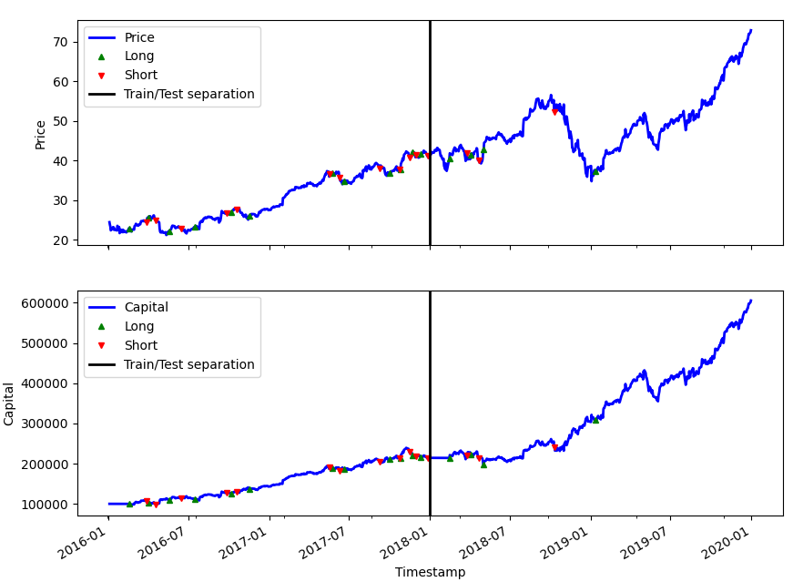
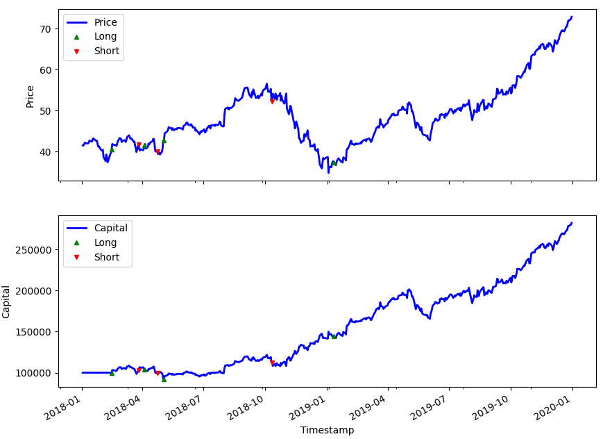
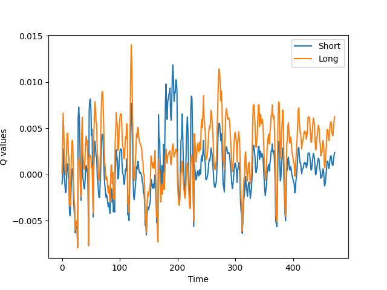
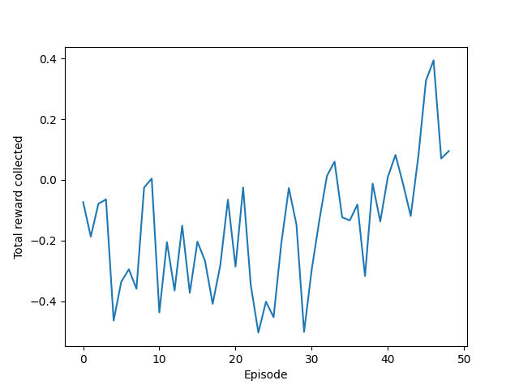
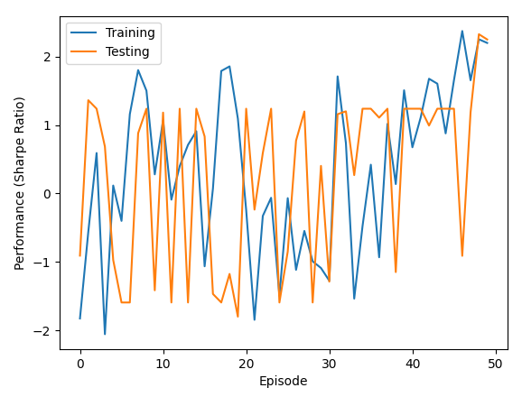
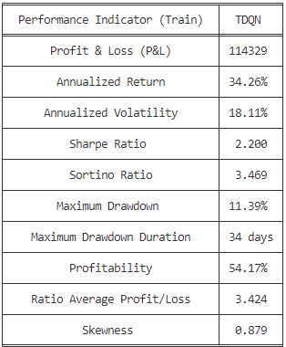
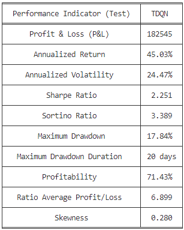

# Algorithmic Trading in Financial Markets Using Deep Reinforcement Learning and LSTM

This repository contains the official source code and implementation of my M.Sc. thesis project, which achieved a **Perfect Score of 20/20**. The project introduces **SDQN** (Sequential Double DQN), an advanced framework that integrates Long Short-Term Memory (LSTM) networks with **Double Deep Q-Networks (DDQN)** to optimize automated trading strategies.

## 🚀 Project Overview
Predicting financial time-series data is highly challenging due to non-stationarity and noise. This project leverages **LSTM** layers to extract robust temporal features from historical market indicators (fetched via `pandas-datareader`). These sequential representations are then fed into the proposed **SDQN** agent. By employing a **Double DQN** architecture implemented in **PyTorch**, the model effectively mitigates the overestimation bias common in standard DQN, leading to highly stable and profitable trading decisions (Buy, Sell, Hold).

## 🛠️ Dependencies
The project is built using Python 3.7.4. All required libraries are listed in the `requirements.txt` file:
* **Deep Learning Framework:** PyTorch 1.5.0 & TensorBoard
* **Environment:** OpenAI Gym
* **Data Processing:** Pandas, NumPy, SciPy, Scikit-Learn
* **Data Visualization:** Seaborn, Matplotlib
* **Financial Data & Utilities:** Pandas-datareader, Statsmodels, Requests, TQDM, Tabulate

To install all dependencies, run:
```bash
pip install -r requirements.txt
```

## 📊 Core Architecture (SDQN)
1. **Temporal Feature Extraction:** LSTM networks process sequential financial data to capture long-term dependencies.
2. **Double Q-Learning:** Separates action selection from action evaluation using PyTorch target networks to handle market volatility.
3. **Advanced Visualization:** High-quality analytical plots stored automatically in the `Figures` directory.

## 💻 Usage
Simulating (training and testing) a chosen supported algorithmic trading strategy on a chosen supported stock is performed by running the following command:

```bash
python main.py -strategy STRATEGY -stock STOCK
```

* **STRATEGY:** The name of the trading strategy (e.g., `SDQN`, or default `TDQN`).
* **STOCK:** The ticker name of the stock (by default `Apple`).

The performance of this algorithmic trading policy will be automatically displayed in the terminal, and some graphs will be generated and stored in the folder named `Figures`.

## 📈 Results & Visualizations

Below are the comprehensive performance charts and indicators generated during the training and backtesting phases, stored automatically in the `Figures` directory:

### 1. Full Horizon Train/Test Separation
This chart illustrates the continuous historical asset price (AAPL) and capital growth across the entire timeline, explicitly marking the **Train/Test separation line** to demonstrate rigorous out-of-sample evaluation.
<p align="center">
  
</p>

### 2. Out-of-Sample Backtesting Performance
A closer look at the dedicated out-of-sample test period for Apple stock (AAPL), capturing precise Long and Short trading execution signals alongside the corresponding capital growth curve.
<p align="center">
  
</p>

### 3. Action-Value (Q-Values) Dynamics
This chart tracks the evolution of estimated Q-values for Short and Long actions over time, illustrating how the neural network dynamically updates its action preferences based on market states.
<p align="center">
  
</p>

### 4. Risk-Adjusted Returns & Total Rewards
* **Total Rewards:** The chart (`AAPLTrainingResults.png`) captures the total accumulated reward per episode, showcasing the positive convergence trend.
* **Sharpe Ratio Progression:** The chart (`AAPL_TrainingTestingPerformance.png`) monitors the Sharpe Ratio behavior across training and testing episodes to ensure stable risk-adjusted returns.

<p align="center">
  
  
</p>

### 5. Quantitative Performance Metrics (Train vs. Test)
The tables below present the exact statistical evaluation metrics. Notably, the model achieves a strong **Sharpe Ratio of 2.251** and a **71.43% Profitability rate** during the out-of-sample Test phase, demonstrating exceptional generalization capability on AAPL stock without overfitting.

<p align="center">
  
  
</p>


## 📬 Contact
* **Developer:** Mohammadreza Ebadi
* **Email:** mohammadreza.ebadi@gmail.com

